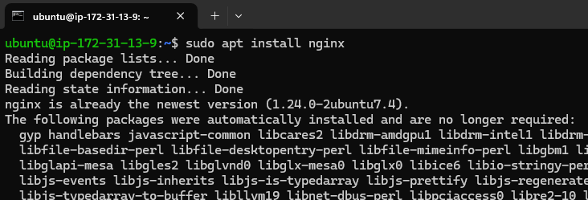
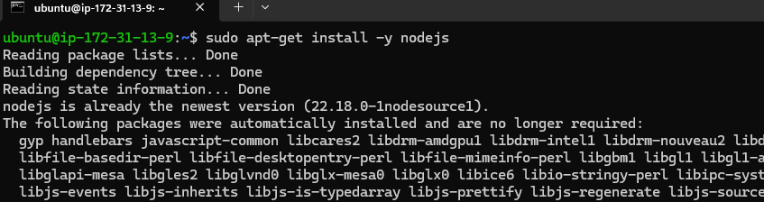

# Travel Memory - Full Stack Deployment on AWS EC2

The **Travel Memory** application is a full-stack project developed using the **MERN (MongoDB, Express.js, React, Node.js)** stack in which user can add and see travel experience.

This **README** serves as a complete guide to deploying the application on an **Amazon EC2** instance, scaling it using load balancers, and connecting it to a custom domain.

### Completion process
- [x] Create EC2 Instances and configure with nginx, nodejs
- [x] Clone **Travel Memory** reposetory
- [x] Configure **React Frontend**
- [x] Configure **Backend** and connect with **MongoDB**
- [x] Setup Load Balancer and Auto Scalling 
- [x] Integrate a **custom domain**
- [x] Deploy Frontend on nginx 


## Create EC2 Instance and configure with nginx, nodejs
- Login AWS account and create two EC2 instance with   
    OS Image - `Ubuntu`  
    Security Group allow inbound rule  - `80, 443, 22, 3000` PORT
    It should be on running states 
    
    
- Connect localmachine using   
    ```
    ssh -i instance_key_pair.pem username@public_IP  
    ```


- Update and Upgrade Linux machine using  
    ```
    sudo apt update && sudo apt upgrade -y
    ```  
    

- Install NGINX  
    ```
    sudo apt install nginx
    ```  
    

- Check nginx  
    ```
    sudo service nginx status
    ```  
    

- Install nodejs  
    ```
    curl -fsSL https://deb.nodesource.com/setup_22.x | sudo bash -
    ```  
     

    ```
    sudo apt-get install -y nodejs
    ```  
    

- Check node version  
    ```
    node -v  
    npm -v
    ```  
    

## Clone Travel Memory reposetory
Clone reposetory in both instances
```
git clone git@github.com:Harshwerdhan/TravelMemory.git
```


## Configure React Frontend
Connect first instance then use
```
cd TravelMemory/frontend
npm install
```
## Configure Backend and connect with MongoDB
Connect second instance then use
```
cd TravelMemory/backend
npm install
```
Connect MongoDB use
```
sudo nano .env
```
Add these two line in `.env` file and change uri with mongodb atls connection string
```
MONGO_URI='ENTER_MONGODB_CONNECTION_URL/database_name'
PORT=3000
```
Install PM2 and run backend
```
npm install pm2
pm2 start index.js
```

## Cloud Architecture diagram
 

## Setup Load Balancer and Auto Scalling group
- Create target group
- Create Load Balancer and use target group

- Create launch templete
- Create auto scalling group and use launch templete

## Integrate a Custom Domain
- Issue Certificate from certificate manager
- Verify using CNAME DNS record
- Add A or CNAME record for **Load Balancer** DNS endpoint

## Configure and Deploy Frontend on nginx
Create `.env` file in frontend directory and add load balancer endpoint
```
REACT_APP_BACKEND_URL=http://BACKEND_ENDPOINT_URL:3000
```
Create build file and deploy on NGINX root directory
```
npm run build
cd build
sudo mkdir /var/www/html/mernapp
cp -r ./ /var/www/html/mernapp
```
Configure NGINX reverse proxy set 
```
root /var/www/html/mernapp;
server_name FRONTEND_URL;
```
Check and Reload NGINX
```
nginx -t
sudo service nginx reload
```